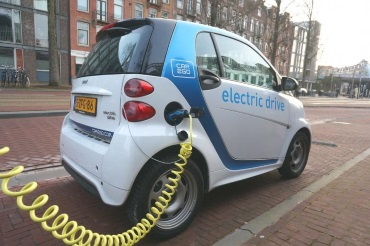

# proiectjs2
A simple web application for learning something... In fact, anything!

## Introducere
Navigând prin Internet poate ați dat peste niște prezentări ale unei metode mai speciale de învățare a unei limbi străine. Sau, mai exact, de extindere a vocabularului cunoscut. Metoda se bazează pe utilizarea unor cartonașe conținând cuvintele care trebuie învățate, dar care nu sunt parcurse la întâmplare sau unul după altul, ci după niște reguli. La baza sistemului sunt cercetăti științifice privind modul în care funcționează creierul uman.

https://www.youtube.com/watch?v=ldkUEfkJX_8 sau https://www.youtube.com/watch?v=eVajQPuRmk8

Există și variante informatice ale metodei, una dintre cele mai utilizate fiind [Anki](https://apps.ankiweb.net/). Fiind și gratuită, o putem instala pentru a vedea dacă este ceea ce ne trebuie. 

Proiectul propus rezolvă o parte a unei aplicații de acest fel, respectiv componenta de *front-end*.


## Resurse necesare

Pentru a începe dezvoltarea proiectului, un prim pas este găsirea unei soluții pentru crearea de carduri care se întorc cu 180 grade dacă se pune cursorul mausului deasupra. Există mai multe soluții. O simplă căutare (folosind cuvintele *html5 create flip card*) returnează însă ca primă variantă o soluție bazată pe HTML5 și CSS prezentată în cunoscutul site - [w3schools](https://www.w3schools.com/howto/howto_css_flip_card.asp).

Codul HTML5 folosit este:

```
<div class="flip-card">
  <div class="flip-card-inner">
    <div class="flip-card-front">
      
    </div>
    <div class="flip-card-back">
      <h1>John Doe</h1> 
      <p>Architect & Engineer</p> 
      <p>We love that guy</p>
    </div>
  </div>
</div>
```

Pentru stilizare s-a folosit următorul ansamblu de reguli:
```
/* The flip card container - set the width and height to whatever you want. We have added the border property to demonstrate that the flip itself goes out of the box on hover (remove perspective if you don't want the 3D effect */
.flip-card {
  background-color: transparent;
  width: 300px;
  height: 200px;
  border: 1px solid #f1f1f1;
  perspective: 1000px; /* Remove this if you don't want the 3D effect */
}

/* This container is needed to position the front and back side */
.flip-card-inner {
  position: relative;
  width: 100%;
  height: 100%;
  text-align: center;
  transition: transform 0.8s;
  transform-style: preserve-3d;
}

/* Do an horizontal flip when you move the mouse over the flip box container */
.flip-card:hover .flip-card-inner {
  transform: rotateY(180deg);
}

/* Position the front and back side */
.flip-card-front, .flip-card-back {
  position: absolute;
  width: 100%;
  height: 100%;
  backface-visibility: hidden;
}

/* Style the front side (fallback if image is missing) */
.flip-card-front {
  background-color: #bbb;
  color: black;
}

/* Style the back side */
.flip-card-back {
  background-color: dodgerblue;
  color: white;
  transform: rotateY(180deg);
}
```

Din ele s-a asamblat prima versiune a aplicației, *card1.html*. Rezultat:


## Primele modificări...

Cardul afișat ar trebui centrat în pagină. În CSS, centrarea unui element în cadrul blocului în care este afișat se realizează folosind proprietatea *margin*:

```
.centrat {
   ...
   margin: 50px auto;
   width: 372px;
   ...
}
```
Cei 20px se referă la mărimea elementului margin pentru latura de sus și de jos iar auto indică browser-ului centrarea pe orizontală.

Ca urmare s-a modificat pagina astfel:

```
<!DOCTYPE html>
<html>
<head>
	<meta charset="utf-8">
	<meta name="viewport" content="width=device-width, initial-scale=1, shrink-to-fit=no">
	<title>Card</title>
	<style>
		body {
			font-family: Arial, Helvetica, sans-serif;
		}

		h1, p {
			margin: 20px auto;
			text-align: center;
		}

		.container {
			width: 372px;
			margin: 50px auto;
		}

		.flip-card {
			margin-top:30px;
			background-color: transparent;
			width: 370px;
			height: 390px;
			perspective: 1000px;
		}

		.flip-card-inner {
			position: relative;
			width: 100%;
			height: 100%;
			text-align: center;
			transition: transform 0.6s;
			transform-style: preserve-3d;
			box-shadow: 0 4px 8px 0 rgba(0,0,0,0.2);
		}

		.flip-card:hover .flip-card-inner {
			transform: rotateY(180deg);
		}

		.flip-card-front, .flip-card-back {
			position: absolute;
			width: 100%;
			height: 100%;
			backface-visibility: hidden;
		}

		.flip-card-front {
			background-color: #ccc;
			color: black;
		}

		.flip-card-back {
			background-color: #2980b9;
			color: white;
			transform: rotateY(180deg);
		}
	</style>
</head>
<body>
	<div class="container">
		<h1>Card: 1 / 20</h1>
		<div class="flip-card">
			<div class="flip-card-inner">
				<div class="flip-card-front">
					
				</div>
				<div class="flip-card-back">
					<h1>John Doe</h1> 
					<p>Architect & Engineer</p> 
					<p>We love that guy</p>
				</div>
			</div>
		</div>
	</div>
</body>
</html>
```

## Realizarea variantei "statice"
La realizarea unei pagini dinamice, având conținuturi care provin din accesarea altor resurse (baze de date de cele mai multe ori) se începe prin realizarea unei variante statice. În această variantă se pot rezolva toate problemele legate de stilizare. Pasul următor este înlocuirea conținuturilor care, în timpul funcționării aplicației, vor fi înlocuite, cu șiruri de forma `{nume}`. În acest mod se pregătește scrierea codului JavaScript.
```
<!DOCTYPE html>
<html>
<head>
	<meta charset="utf-8">
	<meta name="viewport" content="width=device-width, initial-scale=1, shrink-to-fit=no">
	<title>Card</title>
	<style>
		body {
			font-family: Arial, Helvetica, sans-serif;
		}

		h1, p {
			margin: 20px auto;
			text-align: center;
		}

		.container {
			width: 372px;
			margin: 50px auto;
		}

		.flip-card {
			margin-top:30px;
			background-color: transparent;
			width: 370px;
			height: 410px;
			perspective: 1000px;
		}

		.flip-card-inner {
			position: relative;
			width: 100%;
			height: 100%;
			text-align: center;
			transition: transform 0.6s;
			transform-style: preserve-3d;
			box-shadow: 0 4px 8px 0 rgba(0,0,0,0.2);
		}

		.flip-card:hover .flip-card-inner {
			transform: rotateY(180deg);
		}

		.flip-card-front, .flip-card-back {
			position: absolute;
			width: 100%;
			height: 100%;
			backface-visibility: hidden;
		}

		.flip-card-front {
			background-color: #ccc;
			color: black;
		}

		.flip-card-back {
			background-color: #2980b9;
			color: white;
			transform: rotateY(180deg);
		}
	</style>
</head>
<body>
	<div class="container">
		<h1>Card: 1 / 20</h1>
		<p>Hover over the image below:</p>

		<div class="flip-card">
			<div class="flip-card-inner">
				<div class="flip-card-front">
					
					<h1>Electric car</h1>  <!-- Electric car -->
				</div>
				<div class="flip-card-back">
					
					<h1>Automobil electric</h1> 
					<audio controls>
						<source id="sursa" src="audio/audio1.mp3" type="audio/mpeg">
					</audio>
				</div>
			</div>
		</div>
		<p><button id="usor">Ușor</button> <button id="med">Mediu</button> 
			<button id="greu">Greu</button></p>
	</div>
</body>
</html>
```

Rezultat:


Din examinarea codului se observă că, pentru a funcționa, pagina accesează fișierul */imagini/img1.jpg* și *audio/audio1.mp3*. Acestea sunt disponibile pe site, în subdirectoarele */imagini* și */audio*.

## Realizarea variantei dinamice a paginii
După testarea variantei statice, pasul următor este realizarea unei variante dinamice a paginii. Aceasta presupune crearea unei surse de date (de regulă un șir de obiecte), crearea unor șiruri de caractere care conțin pîrți care vor fi substituite cu valorile efective și scrierea codului care asigură înlocuirea dinamică a părților din document cu valorile efective, furnizate de sursa de date, și trecerea la articolul următor.
După realizarea acestor pași, codul aplicației este următorul:

```
<!DOCTYPE html>
<html>
<head>
	<meta charset="utf-8">
	<meta name="viewport" content="width=device-width, initial-scale=1, shrink-to-fit=no">
	<title>Card</title>
	<link rel="stylesheet" type="text/css" href="css/stil.css">
</head>
<body>
	<div class="container">
		<h1>Card: 1 / 20</h1>
		<p>Hover over the image below:</p>

		<div class="flip-card">
			<div class="flip-card-inner">
				<div class="flip-card-front">
					
					<h1>Electric car</h1>
				</div>
				<div class="flip-card-back">
					
					<h1>Automobil electric</h1> 
					<p><button id="usor">Ușor</button> <button id="med">Mediu</button> <button id="greu">Greu</button></p>
					<audio controls>
						<source id="sursa" src="audio/audio1.mp3" type="audio/mpeg">
					</audio>
				</div>
			</div>
		</div>
	</div>
	<script>
  var obiecte = [
    {id: 1, dificultate: 1, imagine: "imagini/img1.jpg", numero: "Autoturism electric", numeen: "Electric car", sunet: "voce/sunet1.mp3"},
    {id: 2, dificultate: 1, imagine: "imagini/img2.jpg", numero: "Trotinetă electrică", numeen: "Electric scooter", sunet: "voce/sunet1.mp3"},
    {id: 3, dificultate: 1, imagine: "imagini/img3.jpg", numero: "Bicicletă", numeen: "Bycicle", sunet: "voce/sunet1.mp3"}
  ];

  var i = 0; // Ob afisat initial

  var cfront = '';
  cfront += '<h1>{titluen}</h1>';

  var cback = '';
  cback += '<h1>{titluro}</h1>';
  cback += '<p><button id="usor">Ușor</button> <button id="med">Mediu</button> <button id="greu">Greu</button></p>';
  cback += '<audio controls><source id="sursa" src="{sunet}" type="audio/mpeg"></audio>';

  document.querySelector("body").onload = function() {
    afisez();
  };

  function afisez() {
    //  preiau obiectul avand class="flip-card-front"
    var front = document.querySelector(".flip-card-front");

    // Inlocuiesc in cfront {titluen} si {pozafront}
    var frontH = cfront.replace("{titluen}", obiecte[i].numeen)
                       .replace("{pozafront}", obiecte[i].imagine);
    front.innerHTML = frontH;

    //  preiau obiectul avand class="flip-card-back"
    var back = document.querySelector(".flip-card-back");

    // Inlocuiesc in cback {titluro} si {pozafront}
    backH = cback.replace("{titluro}", obiecte[i].numero)
                 .replace("{pozaback}", obiecte[i].imagine)
                 .replace("{sunet}", obiecte[i].sunet);
    back.innerHTML = backH;
  }

  document.querySelector(".flip-card-back").addEventListener("click", prelucrez);

  function prelucrez() {
    if(event.target.id === "usor") {
      obiecte[i].dificultate = 1;
      i++;
      if(i < obiecte.length) {
        //console.log("Afisez!");
        afisez();
      } else {
        i--;
    }
  } else if(event.target.id === "med") {
      obiecte[i].dificultate = 2;
      i++;
      if(i < obiecte.length) {
        afisez();
      } else {
        i--;
    }
  } else {
      obiecte[i].dificultate = 3;
      i++;
      if(i < obiecte.length) {
        afisez();
      } else {
        i--;
    }
  }
}
</script>
</body>
</html>
```


